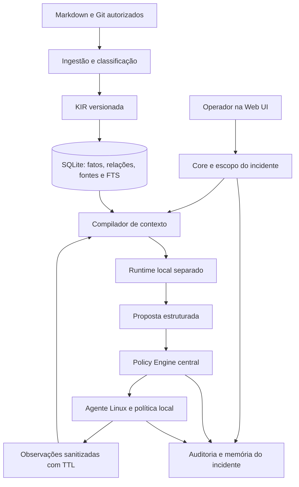

# PRD — Opseld: conhecimento e diagnóstico operacional local

Versão 1.1 • 18/09/2026 • Status: projeto open source em planejamento, sem implementação.

## Direção open source

Nome: **Opseld**. Licença: **Apache-2.0**. Distribuição local sem conta obrigatória, sem API paga obrigatória para a jornada básica e sem telemetria de uso por padrão. Documentação, exemplos e fixtures originais acompanham a licença do projeto; dados privados e pesos mantêm seus próprios regimes e não são publicados automaticamente.

O [plano open source](05-plano-open-source.md) e o [roadmap](../ROADMAP.md) definem a sequência vigente. Primeiro vem uma demo offline com incidentes sintéticos; o v0 operacional descrito abaixo corresponde à alpha Linux posterior. As métricas e a arquitetura serão validadas contra regras sem IA, retrieval simples e alternativa existente antes de ampliar a plataforma. Os requisitos OSS-01 a OSS-08 complementam este PRD.

A organização única e a equipe de referência abaixo são cenários de piloto, não requisitos para participar ou promessas de calendário. O produto deverá ser instalável por operadores externos. Autorização, auditoria, redaction e recuperação integram a distribuição pública planejada.

Base: [análise correlacionada](01-analise-correlacionada.md). Execução: [plano de trabalho](03-plano-de-execucao.md).

## 1. Visão e problema

A plataforma reúne documentação, configuração e estado operacional para ajudar a equipe a investigar incidentes com evidências rastreáveis. Executa inferência local e aplica autorização fora do modelo. Evolui para ações controladas somente quando o diagnóstico e os controles forem demonstrados em piloto.

Hoje, o conhecimento descrito nos anexos está distribuído entre pessoas, Markdown, repositórios, inventários e hosts. A investigação exige reconstruir relações, localizar a configuração relevante e distinguir documentação antiga de estado atual. O impacto esperado é demora de diagnóstico, repetição de investigação e dependência de especialistas. A frequência e o custo desses problemas ainda precisam ser medidos na empresa.

**Proposta de valor do MVP:** informar por que um serviço Linux cadastrado pode estar indisponível, mostrando evidências, hipóteses alternativas, limitações e próximos passos seguros. O produto pode concluir “evidência insuficiente”.

## 2. Usuários e responsabilidades

| Persona | Necessidade | Permissões previstas |
|---|---|---|
| Operador/SRE | Investigar falhas sem reconstruir todo o contexto | Iniciar diagnóstico e consultar evidências em seu escopo |
| Responsável por aplicação | Entender dependências e corrigir conhecimento | Revisar fontes, contestar fatos e validar diagnóstico |
| Curador de conhecimento | Resolver ambiguidades, versões e duplicatas | Administrar fontes e decisões de identidade autorizadas |
| Administrador da plataforma | Cadastrar agentes, políticas e credenciais | Gestão técnica; acesso a dados continua sujeito a escopo |
| Auditor/segurança | Reconstruir o que foi observado e executado | Consultar trilha permitida, sem executar tools |
| Aprovador de mudança, v2 | Avaliar uma ação concreta | Aprovar/rejeitar ação no ambiente sob sua responsabilidade |

Uma pessoa pode acumular funções no piloto, mas a aplicação preserva a separação entre permissões. Desenvolvedores não recebem acesso global apenas por administrar a interface.

## 3. Objetivos e definição de sucesso

As metas seguintes são propostas de engenharia/produto, não resultados já obtidos. Serão calibradas na descoberta e qualquer mudança posterior terá justificativa registrada.

| Objetivo | Métrica e definição | Meta inicial |
|---|---|---|
| Diagnóstico útil | Causa correta entre hipóteses em casos solucionáveis, avaliados por especialista | Top-1 ≥70%; top-3 ≥90% no conjunto reservado |
| Reconhecer limites | Casos deliberadamente insuficientes encerrados sem causa afirmada | ≥90% |
| Rastreabilidade | Afirmações com referência resolvível e suporte semanticamente correto; inferências com evidências | 100% no momento da emissão; exclusões posteriores autorizadas ficam explícitas |
| Menos trabalho humano | Tempo ativo de investigação, comparando cenários equivalentes | Redução mediana ≥25% no piloto |
| Utilidade percebida | Diagnósticos classificados como úteis pelos operadores | ≥80%, com motivo para rejeições |
| Isolamento | Chamadas fora do escopo aceitas e vazamentos entre escopos | Zero na suíte de segurança |
| Auditoria | Intenções, recusas e execuções cobertas por eventos | 100% |
| Contexto eficiente, v1 | Tokens versus baseline de chunks com qualidade comparável | Redução mediana ≥30%, perda de top-3 ≤2 pontos percentuais |

MTTR será acompanhado, mas a meta primária do MVP é tempo de diagnóstico: o produto ainda não faz reparos. Amostras pequenas devem apresentar contagens absolutas e intervalo de incerteza; 20 incidentes não demonstram uma taxa rara de erro.

## 4. Premissas de planejamento

- Uma organização, uma instância central, até cinco operadores no piloto; isolamento por projeto/ambiente desde o schema inicial.
- Máquina candidata com 32 GB de RAM e CPU a inventariar; GPU não presumida.
- Um host Linux de laboratório/piloto e até três serviços cadastrados no MVP. Distro e versão exatas serão homologadas em G0.
- Um repositório Markdown como fonte inicial; não é necessário plugin do Obsidian.
- Até 1.000 documentos, 10.000 entidades e 100.000 relações como envelope de teste inicial, não como limite comprovado do armazenamento.
- Três a cinco projetos e 20–50 incidentes para descoberta; expansão da amostra antes de conclusões fortes.
- Operação offline após provisionar software e pesos. Serviços externos desligados por padrão.
- Equipe de referência: liderança Rust/backend, engenharia de IA/dados, apoio de Infra/SecOps e frontend/UX.

Se acesso a dados, hardware ou especialistas não estiver disponível, usar fixtures sintéticas identificadas como tais e replanejar o gate. Dados sintéticos não comprovam valor operacional real.

## 5. Escopo por versão

| Capacidade | MVP / v0 | v1 | v2 limitada |
|---|---|---|---|
| Conhecimento | Markdown estruturado + inventário cadastrado | Lockfiles, Compose e metadados Git | Consolidação avançada |
| Identidade | Chaves exatas e aliases revisados | Busca de candidatos e revisão semântica | Aprimoramento por avaliação |
| Recuperação | FTS e relações explícitas | Grafo + vetor + memória de incidentes | Otimização medida |
| Operação | Um host Linux, leitura | Frota; Windows e Proxmox por conector | Ações selecionadas |
| Experiência | Incidente, evidência, fontes, fila e feedback | Relações, drift e contestação | Aprovação e validação de ações |
| Inferência | Um modelo local por vez | Roteamento local e externo opcional | Modelo adaptado apenas se justificar |
| Segurança | Escopo, política local, mTLS, redaction e auditoria | Gestão ampliada de credenciais/frota | Aprovação vinculada e recuperação |

Fora do escopo planejado por este PRD: treinar modelo do zero, escrever runtime/kernels, shell genérico, autonomia irrestrita, ações destrutivas, SaaS multiempresa, aplicativo móvel, ingestão arbitrária da internet, APM completo, HA distribuída e substituição do sistema de tickets. LoRA é experimento separado, não pré-requisito de v2.

## 6. Jornadas essenciais

### J1 — Diagnosticar indisponibilidade

1. Operador escolhe projeto, ambiente, host e serviço autorizado; informa sintoma e janela temporal.
2. Sistema valida escopo, agente disponível, capacidade de leitura e orçamento da fila.
3. Recupera runbook e relações, destacando idade e lacunas. Coleta o estado corrente permitido.
4. Compila contexto limitado; o modelo propõe hipóteses e, se necessário, uma tool tipada.
5. Política central e local validam a chamada; a coleta retorna evidência sanitizada.
6. Interface mostra resultado com causa provável, até três hipóteses, evidências favoráveis/contrárias e próximos passos.
7. Operador aceita, corrige ou marca inconclusivo. Um serviço só é marcado como recuperado mediante observação posterior ou registro humano identificado.

Exemplo de aceite: runbook declara que uma aplicação usa o volume `/srv/app`; coleta mostra volume cheio e logs autorizados mostram falha de gravação. O diagnóstico vincula ambas as evidências e recomenda revisão do uso do volume, sem excluir arquivos.

### J2 — Atualizar conhecimento

Curador altera o repositório. A ingestão gera um candidato de snapshot, valida schema e sensibilidade e publica atomicamente. A interface mostra alterações e rejeições. Um commit defeituoso não remove a versão anterior válida.

### J3 — Resolver divergência

A interface apresenta declarações com fonte, tempo, ambiente e natureza desired/observed. O responsável corrige a fonte, confirma drift ou resolve contradição real. A decisão fica no histórico; o texto gerado pela IA nunca sobrescreve automaticamente documentação aprovada.

### J4 — Executar ação, somente v2

Operador recebe uma proposta concreta com alvo, parâmetros, impacto, pré-condições e recuperação. Um aprovador autorizado confirma seu hash e validade. O executor revalida o estado, deduplica requisições e verifica resultado. Efeito externo sem confirmação persistida gera estado UNKNOWN e reconciliação, sem garantia genérica de exactly-once. Alterar parâmetros, alvo ou pré-condições invalida a aprovação.

## 7. Requisitos funcionais

Prioridade P0 significa obrigatória para a versão indicada; P1 significa evolução condicionada aos gates.

| ID | Versão/prioridade | Requisito | Critério de aceite |
|---|---|---|---|
| RF-01 | v0/P0 | Cadastrar projetos, ambientes, hosts e serviços com owner e escopo | Nome ambíguo exige seleção; nenhuma coleta antes de autorização |
| RF-02 | v0/P0 | Ingerir Markdown/Git incrementalmente, com hash e versão do extrator | Reingestão idêntica não duplica fatos; remoções invalidam derivados; arquivo inválido é isolado |
| RF-03 | v0/P0 | Representar entidades, relações, fatos, fontes e tempo na KIR | Toda afirmação tem tipo, escopo, proveniência e estado; fonte inexistente impede publicação |
| RF-04 | v0/P0 | Canonicalizar por identificador e regras exatas | Mesmo produto pode ser reutilizado; instâncias de prod/homolog permanecem distintas |
| RF-05 | v0/P0 | Executar cinco tools Linux de leitura, com argumentos e saída limitados | Entradas malformadas, comandos livres e alvos não cadastrados são recusados |
| RF-06 | v0/P0 | Recuperar por texto e relações e compilar contexto com budget | Filtro de escopo antecede retrieval; citações e fatos críticos sobrevivem à compactação |
| RF-07 | v0/P0 | Diagnosticar em máquina de estados com limites e abstenção | Timeout, repetição ou falta de evidência encerram com resultado parcial explícito |
| RF-08 | v0/P0 | Exibir incidente, evidências, hipóteses, fontes, fila e feedback | Usuário consegue abrir cada fonte permitida e corrigir o diagnóstico sem editar auditoria |
| RF-09 | v0/P0 | Auditar intenções, decisões, chamadas, resultados e feedback | Falha de persistência bloqueia novo despacho; retomada reconcilia chamadas pendentes |
| RF-10 | v0/P0 | Gerir credenciais por referências opacas e redigir dados sensíveis | Credenciais de teste não aparecem em DB, logs, prompts, índices, exports ou backups comuns |
| RF-11 | v0/P0 | Fazer enrollment, autenticar agente, negociar capabilities e revogar acesso | Agente desconhecido/revogado/incompatível não recebe chamadas |
| RF-12 | v0/P0 | Marcar freshness e divergências; manter owner e histórico | Evidência expirada aparece como histórica; conflito não é resolvido por simples “última escrita” |
| RF-13 | v1/P0 | Integrar Windows e Proxmox com normalização própria | Cada conector passa contrato, permissões e casos reais em ambiente descartável |
| RF-14 | v1/P0 | Adicionar parsers, busca híbrida, incidentes similares e impacto | Consultas de dependência retornam caminhos verificáveis e não cruzam escopos |
| RF-15 | v2/P0 | Aprovar e executar catálogo limitado de ações | Aprovação expirada/modificada/reutilizada é rejeitada; validação e recuperação auditadas |
| RF-16 | v1/P1 | Consultar documentação externa e modelo externo autorizado | Egress desligado funciona; quota e classificação impedem envio não permitido |
| RF-17 | pós-v1/P1 | Exportar dataset curado e avaliar adaptação de modelo | Sem segredos, com licença/base legal interna analisada e conjunto reservado por incidente |

### RF-02: fronteira de ingestão

Ingestão inicial aceita diretórios cadastrados e revisões Git identificadas; não executa scripts, macros, instruções de Markdown ou comandos de arquivos de configuração. Links externos não são buscados automaticamente. Symlinks/path traversal não podem escapar da raiz autorizada. Limite inicial: 2 MiB por documento; arquivo maior é rejeitado com motivo.

Markdown estruturado e relações explícitas formam o grafo inicial. Extração probabilística de prosa pode sugerir rascunhos; não é necessária para o MVP nem pode publicar automaticamente fatos autoritativos.

### RF-05: catálogo inicial de tools

| Tool | Entrada permitida | Saída sanitizada | Limite inicial |
|---|---|---|---|
| `system.summary` | Host cadastrado | SO, uptime, CPU e memória agregados | 5 s; 32 KiB |
| `service.status` | ID de serviço do inventário | Estado, transição recente, PID quando permitido | 5 s; 32 KiB |
| `filesystem.usage` | IDs de mounts cadastrados | Capacidade, uso e inodes; sem conteúdo de arquivos | 5 s; 32 KiB |
| `network.check` | ID de endpoint cadastrado e modo DNS/TCP | Resolução/conectividade e duração | 5 s; 32 KiB |
| `logs.query` | Serviço, janela, severidade e cursor | Eventos sanitizados, timestamps e truncamento | 10 s; 200 eventos ou 64 KiB |

Sem `docker.inspect`, leitura genérica de arquivo ou shell no v0. Rede aceita apenas destinos explícitos do serviço e bloqueia endpoints de metadados e destinos fora do escopo. DNS deve ser revalidado contra destinos permitidos para evitar mudança de resolução. Consultas de log usam operações predeterminadas, nunca uma expressão de shell fornecida pelo modelo.

O agente roda com acesso mínimo. Se uma leitura exigir privilégio adicional, um coletor restrito pode expor apenas campos permitidos. Permissão insuficiente gera evidência indisponível, sem escalada automática.

### RF-07: máquina de estados e parada

Estados: `QUEUED → COLLECTING → REASONING → NEEDS_EVIDENCE → COLLECTING → COMPLETED | INCONCLUSIVE | FAILED | CANCELLED`. A transição de raciocínio pode ir diretamente ao encerramento.

Limites por incidente v0: cinco turnos de inferência, dez chamadas de ferramenta no total, uma correção de schema por turno e deadline de processamento de 120 s. O primeiro limite atingido encerra a investigação. As tentativas extras consomem os mesmos budgets; chamada equivalente sem evidência nova não é repetida indefinidamente.

Saída final estruturada: resumo, sintoma, janela, hipóteses ordenadas, evidências favoráveis/contrárias, fatos desconhecidos, próximos passos e estado de conclusão. Confiança textual deve distinguir evidência forte/fraca; não exibir probabilidades numéricas sem calibração.

## 8. Modelo de conhecimento e autoridade

### 8.1 Objetos essenciais

| Objeto | Campos mínimos | Regra |
|---|---|---|
| Entity | ID estável, tipo, canonical key, escopo, atributos | Chave não se baseia só no nome de exibição |
| Source | ID, URI/path permitido, repo/commit, hash, span, classificação | Identifica versão imutável ou observação concreta |
| Fact | Sujeito, predicado, valor/objeto, classe, tempo, status | Pode ter várias evidências |
| EvidenceLink | Fact/diagnóstico, source/observation, papel | Permite suporte e refutação explícitos |
| Relation | Sujeito, predicado, objeto, escopo, validade | Direção e tipos definidos no schema |
| Observation | Agente, alvo, campo, valor sanitizado, collected_at, received_at, TTL | Estado corrente só dentro da validade |
| Derivation | Regra/version, IDs de entrada, resultado | Recomputável, sem dependência de prosa gerada |
| Snapshot | ID, parent, schema, fontes, índices, status | Publicação atômica de geração consistente |
| Incident | Alvo, sintoma, status, evidências, feedback, resolução | Diagnóstico aceito não equivale a serviço recuperado |
| ToolCall | Request, ator, alvo, parâmetros redigidos, política, estado | Intenção e resultado identificados separadamente |
| SecretRef | ID opaco, owner, tipo, data de rotação, referência restrita | Nunca armazena valor em KIR |
| Approval, v2 | Ator, action hash, escopo, validade, uso | Vinculada a uma proposta específica |

Separar `Product`, `ProductVersion`, `Instance` e `Usage`. Compartilhar definição de um produto não autoriza compartilhar sua instância ou configuração sensível. Overrides pertencem à instância/uso e não alteram a definição global.

Classes epistemológicas: `SOURCE` para informação explicitamente extraída; `DERIVED` para resultado de regra determinística; `INFERRED` para hipótese probabilística. Todas possuem proveniência; apenas as duas primeiras dispensam inferência probabilística na obtenção.

### 8.2 Tempo, revisão e conflito

Guardar `valid_from/valid_to` para validade no domínio e `recorded_at/superseded_at` para quando o sistema conheceu a informação. Isso permite representar um evento descoberto com atraso. Datas de coleta e recebimento permanecem distintas, com sinalização de relógio suspeito.

Manter dimensões independentes:

- Revisão: `PENDING`, `ACCEPTED`, `CONTESTED`, `REJECTED`.
- Ciclo de vida: `CURRENT`, `SUPERSEDED`, `RETRACTED`.
- Freshness: `FRESH`, `STALE`, `UNKNOWN`.
- Natureza: `DESIRED`, `OBSERVED`, `HISTORICAL`.

Uma observação pode ser aceita, corrente e stale ao mesmo tempo. Expirar TTL não apaga história. Novo dado encerra a validade anterior conforme regra de domínio, sem sobrescrever evidência original.

| Informação | Autoridade de referência | Freshness inicial |
|---|---|---|
| Arquitetura desejada | Markdown/IaC aprovado, versão exata | Revisão proposta a cada 90 dias |
| Dependência resolvida | Lockfile e commit | Válida para aquele commit, não automaticamente para deploy |
| Serviço em execução | Coleta autorizada no host | 30 s |
| CPU/memória/volume | Agente | 15 s |
| Teste de rede | Agente e endpoint verificado | 30 s |
| Estado de VM, v1 | API do cluster cadastrado | 60 s |
| Metadados de segredo | Backend de secrets | 300 s |
| Advisory externo, v1 | Publicação com versão e data | Revalidar em até 24 h |

TTL mede validade para decisões correntes; retenção mede por quanto tempo manter histórico. Eventos de logs continuam válidos como acontecimentos passados, embora não provem estado atual.

Conflitos reais geram item com owner, severidade, evidências e prazo: um dia útil para fato que bloqueie ação, cinco dias úteis para documentação sem impacto imediato. Sem resposta, escalar ao administrador e preservar bloqueio. Fatos stale/contested podem aparecer como contexto explicitamente marcado; não satisfazem pré-condições de ação. Correlação temporal é hipótese causal, não prova.

### 8.3 Snapshot, rebuild e exclusão

Ingestão prepara nova geração, valida integridade e só então troca o ponteiro ativo. Diagnóstico fixa a geração lógica usada; coleta corrente mantém timestamps próprios. Não manter transação de banco aberta durante a inferência. Falha deixa o snapshot anterior disponível. Revalidar autorização antes de inferência, tools, resposta e export; revogação atual prevalece sobre a geração histórica e invalida contexto/cache afetado.

Rollback de KIR não restaura logs removidos nem desfaz operações no host. Exclusão/revogação de fonte invalida fatos, relações dependentes, chunks, embeddings e caches afetados. Tombstones impedem ressurgimento após restore. Em conflito entre reconstruibilidade e retenção de dados sensíveis, preservar somente referências/metadados permitidos e declarar evidência indisponível.

## 9. Arquitetura proposta

Core e agente em Rust são escolhas propostas de implementação, herdadas da direção do blueprint. Runtime local é um processo separado. SQLite armazena o domínio; grafo inicial é representado por tabelas, e vetor não é dependência de v0. A documentação de suporte de runtime e as ressalvas sobre modelos estão na análise correlacionada; nenhuma velocidade é assumida aqui.

Interfaces internas previstas: `InferenceProvider`, `KnowledgeStore`, `Retriever`, `ToolExecutor`, `SecretResolver` e `AuditSink`. Não transformar essa separação em um framework público de plugins no MVP.

Comunicação Core/agente usa contrato versionado e identidade mútua; gRPC/Protobuf é candidato. A escolha de bibliotecas HTTP, async e UI fica em ADR técnico com documentação atual, sem acoplar os critérios do produto a um framework frontend.

O compilador filtra autorização antes de recuperar e antes de devolver referências. Seleciona identidade, relações relevantes, configuração e evidências; deduplica fontes sem ocultar contradições. Usa tokenizer do modelo real, reserva saída e recusa exceder o budget. Cache é segregado por escopo, geração, versões e freshness. Memória de conversa não é automaticamente memória corporativa.

## 10. Segurança e operação confiável

### 10.1 Fronteiras de confiança

Markdown, logs, nomes de host, metadados Git, descrições de VM, conteúdo web e saídas de ferramentas são dados não confiáveis. Nenhum deles modifica política, tool registry, prompt de sistema ou aprovação. O modelo propõe intenções; o código valida tipos, escopo, custo, tempo e permissões.

A UI exige autenticação, expiração de sessão e autorização por projeto/ambiente. URLs diretas, exports e referências de fontes aplicam a mesma checagem da busca. Conteúdo de Markdown/log é escapado; não executar HTML ou links ativos não autorizados.

Agente tem identidade por instalação, enrollment de uso único, rotação/revogação e política local administrada separadamente. O Core não amplia capabilities por uma chamada operacional. Comprometimento do host continua um limite de confiança: registrar origem e buscar confirmação independente quando necessário.

### 10.2 Segredos e redaction

Credenciais ficam em backend separado com ACL mínima e criptografia/proteção do sistema operacional apropriada ao ambiente. Config versionada contém referências opacas. Tokens não aparecem em argumentos de processo, erros ou dumps. A versão inicial do backend será escolhida em G0; não requer obrigatoriamente um serviço Vault completo.

Classificação: `PUBLIC`, `INTERNAL`, `CONFIDENTIAL`, `SECRET`. Valor `SECRET` não entra na KIR, embedding, prompt ou audit comum. Dados de alto risco são filtrados no agente antes do transporte; o Core faz segunda validação. Conteúdo que não possa ser sanitizado com confiança é bloqueado/quarentenado, com registro sem o payload.

Armazenar cópia sanitizada de evidência operacional para investigação e hash dessa cópia. Se uma fonte original precisar ficar sob custódia restrita, usar armazenamento e autorização separados; não replicar segredo para “garantir proveniência”. Redaction baseada em padrões não oferece cobertura universal, por isso deve ser combinada com minimização e allowlists.

### 10.3 Auditoria e falhas

Cada evento inclui ID, correlação, ator, escopo, tool/schema, políticas avaliadas, timestamps, decisão, referência de evidência e versões de modelo/prompt quando relevantes. Registrar justificativa operacional curta, sem exigir raciocínio interno do modelo.

Intenção autorizada deve estar durável antes de despacho. Agente registra início/fim localmente e concilia na reconexão. Timeout deixa estado `UNKNOWN` até reconciliação; não presume que uma ação futura falhou. Trilha com encadeamento de hashes detecta alterações, mas não oferece imutabilidade contra um administrador total; cópia independente amplia a proteção.

### 10.4 Risco de tools e ações futuras

Separar quatro eixos: mutação, privilégio, sensibilidade e impacto operacional. “Read-only” não significa acesso livre; “restart” não significa rollback garantido.

v2 inicia com apenas um tipo de ação em um serviço de homologação selecionado. Cada ação possui pré-condições, efeito, idempotência, timeout, validação e recuperação classificada como rollback verdadeiro, compensação ou intervenção manual. Ações destrutivas continuam fora do catálogo.

O agente revalida pré-condições imediatamente antes de executar, serializa mutações por alvo e rejeita replay. Aprovação é de uso único, expira em até cinco minutos por padrão e vincula parâmetros, alvo, ambiente, schema e política. Pré-condição alterada exige nova proposta. Dry-run não prova ausência de impacto.

### 10.5 Internet e custos, v1 opcional

Provedores externos exigem habilitação explícita por administrador e regra por classificação/escopo. Dado confidencial exige autorização específica; redaction isolada não o torna público. Metadados da infraestrutura também são sensíveis.

Aplicar teto por requisição, incidente e dia; reservar orçamento antes do despacho para evitar corrida; falhar fechado sem configuração de preço/quota válida. Default de gasto externo é zero. Logs de erro do provider passam por redaction. Sem provedor externo disponível, manter diagnóstico local ou declarar insuficiência.

## 11. Requisitos não funcionais e medição

Todos os tempos são metas propostas no hardware inventariado. Reportar p50/p95, cold/warm, tamanho de entrada/saída e número de amostras. A fila é medida separadamente e também compõe o tempo percebido pelo operador.

| ID | Requisito | Meta/limite inicial e condição |
|---|---|---|
| RNF-01 | Latência | p95 ≤30 s para diagnóstico simples warm; ≤120 s multietapas. TTFT warm ≤3 s é alvo exploratório, não promessa antes do benchmark |
| RNF-02 | Memória e tokens | Janela máxima 16.384 tokens: entrada total ≤12.288 e geração ≤4.096, incluindo tokens de raciocínio quando presentes. Working set agregado candidato ≤24 GiB na máquina de 32 GB |
| RNF-03 | Concorrência | Uma inferência ativa; teto de cinco pendências, condicionado a previsão de espera ≤120 s. Admission control rejeita antes de admitir trabalho sem capacidade estimada; expiração e cancelamento explícitos |
| RNF-04 | Agente | RSS ≤150 MiB; CPU média de 60 s ≤2% de um núcleo em coleta normal; reportar picos e workload |
| RNF-05 | Retenção | Coleta sanitizada geral 7 dias; agregados 30; incidentes/feedback e pacote mínimo sanitizado de suporte 180; auditoria 365. Exclusão autorizada prevalece e remove cópias derivadas. Valores sujeitos à política do operador |
| RNF-06 | Atualização | p95 fonte aprovada→snapshot disponível ≤60 s em incrementos de até dez arquivos dentro dos limites v0 |
| RNF-07 | Recuperação | RPO ≤24 h para conhecimento/incidentes e RTO ≤4 h no piloto, demonstrados em restore. Auditoria usa journal durável por chamada, sem alegar RPO zero em perda total do host |
| RNF-08 | Disponibilidade | Alvo 99% na janela de operação acordada; medir separadamente indisponibilidade do agente, Core e runtime |
| RNF-09 | Evolução | Schema/protocolo/modelo/prompt fixados por release; migração com backup e rollback ensaiado |
| RNF-10 | Operação offline | Após provisionamento, diagnóstico v0 funciona com egress bloqueado e sem API externa |
| RNF-11 | Usabilidade | Fluxos principais por teclado, estado não indicado só por cor, textos legíveis e tabela alternativa ao grafo |
| RNF-12 | Disco e pressão | Alertar a 70/85/95% da quota; reduzir coleta opcional em 85%; bloquear novas coletas em 95% preservando espaço reservado de auditoria |

Budget de geração é teto, não alvo: uma resposta de 4.096 tokens pode não caber no SLO. O loop usa deadline real e resultados parciais. Sem espaço para instruções, schemas e evidências essenciais, reduzir escopo ou declarar insuficiência; não cortar silenciosamente fonte crítica.

Telemetria exposta: latência de ingestão/retrieval/inferência/tool, queue wait, tokens, memória, CPU, rejeições de política, expiração de evidência, erros de schema e tamanho do banco. Labels de métricas não carregam conteúdo sensível ou cardinalidade ilimitada.

## 12. UX mínima e comportamento de erro

| Área | Conteúdo necessário | Estados essenciais |
|---|---|---|
| Incidentes | Alvo, ambiente, sintoma, andamento, cancelamento | Vazio, em fila, executando, parcial, concluído, inconclusivo |
| Diagnóstico | Hipóteses, evidências e lacunas | Fonte revogada, resultado sem suporte, agente offline |
| Fontes | Revisão/hash, última ingestão, erros, snapshot ativo | Ingestão rejeitada e rollback |
| Inventário | Owner, serviços permitidos, capabilities e freshness | Host desconhecido, certificado expirado, incompatibilidade |
| Auditoria | Eventos filtráveis e correlação | Acesso negado, evidência retida somente como metadado |
| Conhecimento, v1 | Relações, fatos e contestação | Merge pendente, stale, drift e conflito |
| Ações, v2 | Proposta, impacto, aprovação, validação | Expirada, cancelada, estado mudou, recuperação manual |

O resultado diferencia “serviço parado” de “host não respondeu”. Exibe timestamps absolutos e fuso, além de idade. Não usa indicador verde para um diagnóstico apenas aceito pelo operador se o serviço ainda não teve recuperação verificada.

## 13. Avaliação e critérios de liberação

Conjunto inicial: 20–50 incidentes distintos, agrupados por causa/ambiente para impedir vazamento entre desenvolvimento e teste. Reservar pelo menos 20 casos antes da liberação do MVP; ampliar coleta se o corpus total inicial for pequeno. Repetições de um incidente medem variabilidade, não aumentam o número de casos independentes. Replay só utiliza informação disponível até o instante simulado, excluindo postmortems futuros e resoluções duplicadas. Comparar baseline humano, regras determinísticas, retrieval simples e contexto compilado. Casos públicos são sintéticos ou explicitamente autorizados para redistribuição.

Cobrir serviço parado, volume cheio, pressão de memória, falha de resolução/conectividade, configuração divergente, problema posterior a mudança, agente indisponível e evidência insuficiente. No MVP, causas fora do alcance das cinco tools devem resultar em abstenção ou próxima coleta sugerida, não precisão inventada.

| Gate | Condição de passagem |
|---|---|
| G0 — viabilidade | Corpus e hardware identificados; configuração local executa smoke tests de texto/schema/tools sem OOM; versões/hash registrados; NFRs ratificados ou revisados formalmente |
| G1 — fundação | Ingestão/snapshot/rebuild passam fixtures; políticas e redaction passam suíte adversarial; isolamento completo |
| G2 — MVP | RF-01 a RF-12 completos; metas de diagnóstico e rastreabilidade no conjunto reservado; restore aprovado; zero mutações possíveis no catálogo |
| G3 — expansão | Cada conector passa testes próprios; busca híbrida mostra ganho sem regressão de escopo; piloto de quatro semanas avaliado |
| G4 — execução limitada | Ação selecionada passa duplicação, timeout, mudança de estado, revogação e recuperação; shadow mode revisado; responsável operacional aceita risco residual |

Falsos merges: no MVP, zero no conjunto curado de pelo menos 200 pares adversariais; isso não certifica taxa populacional. Em v1, ampliar conjunto e reportar precisão/recall por tipo. Cobertura de proveniência mede presença de fonte; correção de atribuição é avaliada separadamente contra gabarito.

Falhas de schema não podem disparar tools. Mudança de modelo, prompt, quantização, extrator ou política executa replay relevante. Nenhuma regressão crítica de segurança é compensada por ganho médio de qualidade.

## 14. Riscos e decisões abertas

| Risco/decisão | Tratamento | Responsável proposto |
|---|---|---|
| CPU não alcança latência | Medir 4B/9B e alternativa; reduzir contexto ou rever hardware/SLO | IA + Tech Lead |
| Falta de corpus real | Fixtures identificadas, entrevistas e coleta; limitar alegações | Produto + SRE |
| Identidade errada | Canonicalização conservadora e revisão de ambiguidades | Dados |
| Acesso excessivo a logs | Campos allowlisted, mínimo privilégio e redaction | SecOps |
| Crescimento do escopo | Releases com gates; Windows/Proxmox separados | Produto |
| Dependência de biblioteca/licença | Fixar versão e revisar licença antes de incorporar | Tech Lead |
| Falha de restauração | Exercício em ambiente limpo e registro de evidências | Infra |
| Fonte manipulada/host comprometido | Tratar origem como não confiável; corroborar e bloquear ações | SecOps |

Decisões a fechar na descoberta: distribuição Linux e serviços do piloto; inventário real da máquina; owners e operadores; método de autenticação; janela operacional; retenção e quota de disco; disponibilidade da equipe; custo interno por função; restrições de saída de dados. Até lá, valem as premissas explícitas deste PRD para estimativa, sem tratá-las como decisões já tomadas pelo usuário.
