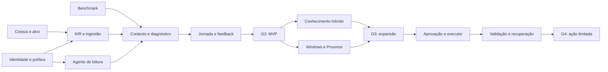

# Plano de execução — Opseld

Versão 1.1 • 18/09/2026 • Decomposição de esforço preservada como cenário de equipe dedicada.

## Atualização para open source

O projeto se chama **Opseld**, sob **Apache-2.0**. A sequência vigente é o [roadmap por marcos](../ROADMAP.md), detalhado no [plano open source](05-plano-open-source.md). Antes de comprometer a plataforma completa, entregar demo offline sintética e comparar regras, retrieval simples, KIR mínima e alternativa existente.

Os prazos deste documento pressupõem a equipe indicada e não são compromissos públicos. Contribuidores voluntários não são capacidade garantida. Reestimar pela disponibilidade real, incluindo revisão e manutenção; evitar descontar novamente trabalho já incluído nos pacotes. Windows e Proxmox podem ser sequenciados conforme demanda e responsáveis. Ação limitada depende dos controles relevantes, não de finalizar todos os conectores.

Antes de alpha pública: publicar identidade real dos mantenedores, ativar canal privado de segurança, verificar licença/origem dos artefatos, testar instalação em ambiente limpo e fornecer fixtures sem dados privados. Nenhuma dessas ações externas foi realizada pela preparação local dos documentos.

Referências: [análise correlacionada](01-analise-correlacionada.md) e [PRD](02-prd.md).

## 1. Estratégia de entrega

Construir uma vertical completa antes de expandir integrações: fonte Markdown autorizada → KIR versionada → contexto com evidências → inferência local → agente Linux de leitura → diagnóstico e feedback na UI.

A descoberta valida a configuração de inferência, o problema do usuário e as permissões. Durante essa fase podem avançar fixtures, schema e contratos usando um provedor simulado. Uma falha em um modelo não paralisa trabalho independente nem justifica criar um runtime próprio.

O primeiro compromisso de entrega é diagnóstico útil e verificável em um host. O compromisso de expansão só ocorre depois do gate correspondente. Fine-tuning e comparativos extensos de frameworks não entram no caminho crítico do MVP.

## 2. Equipe, governança e disponibilidade

| Papel | Alocação de referência no MVP | Responsabilidade |
|---|---:|---|
| Tech Lead/Rust backend | 1,0 FTE | Core, contratos, domínio, armazenamento e integração |
| IA/dados | 1,0 FTE | Corpus, avaliação, inferência, ingestão e contexto |
| Infra/SecOps | 0,5 FTE | Agente, credenciais, políticas, instalação e recuperação |
| Frontend/UX | 0,5 FTE | Fluxos do operador, evidências, fila e feedback |
| Product owner/SRE especialista | 2–4 h por semana, fora dos 3 FTE | Priorização, gabaritos, validação operacional e gates |

FTE é dedicação equivalente em tempo integral. Os papéis não exigem cinco pessoas diferentes, mas acumular papéis cria gargalos. O esforço estimado inclui testes e documentação das entregas; trabalho do especialista de negócio deve ser reservado adicionalmente.

Planejar aproximadamente 70% de capacidade útil para implementação, considerando revisão, integração, interrupções e coordenação: 3 FTE × 0,70 = 2,1 pessoa-semanas entregues por semana de calendário. Essa premissa não substitui os limites do caminho crítico.

Ritmo proposto: planejamento semanal; demonstração quinzenal de uma jornada executável; atualização do registro de riscos; revisão técnica antes de cada gate. Toda mudança material de escopo ou meta deve atualizar PRD, estimativa e ADR associado. ADR registra problema, opções, decisão, evidência, versão e condição de revisão.

## 3. Estimativa e calendário de referência

| Fase | Esforço base | Calendário indicativo com equipe de referência | Saída |
|---|---:|---:|---|
| F0 — descoberta e viabilidade | 4–6 pessoa-semanas | 2–3 semanas | G0 |
| F1 — MVP Linux somente leitura | 16–24 pessoa-semanas | 8–12 semanas | G1 e G2 |
| F2 — conhecimento e multiplataforma | 28–44 pessoa-semanas | 14–21 semanas | G3 |
| F3 — execução limitada | 24–40 pessoa-semanas | 12–20 semanas | G4 |
| **Total base** | **72–114 pessoa-semanas** | **36–56 semanas sequenciais** | Plataforma com execução limitada |

O MVP, incluindo descoberta, tem envelope base de **20–30 pessoa-semanas e 10–15 semanas de calendário**. Para compromisso comercial ou interno, reservar 20–25% de contingência sobre o esforço: aproximadamente 24–38 pessoa-semanas para o MVP e 86–143 para o programa completo. A reserva não adiciona escopo automaticamente.

As faixas são julgamentos de engenharia baseados na decomposição abaixo, não estimativas estatísticas P50/P90. A capacidade da equipe, a maturidade dos conectores e o acesso aos dados mudam o prazo. Em cenário de um único profissional a 70% de disponibilidade, o MVP exige aproximadamente 29–43 semanas antes de contingência, além de eventuais esperas externas.

O período de quatro semanas de observação do piloto pode se sobrepor ao trabalho de expansão, mas G3 não é aprovado antes de completá-lo. Não converter 16 pessoa-semanas diretamente em 16 semanas sem informar a equipe.

Não há orçamento financeiro confiável sem custo por função. Usar: `custo = soma(esforço por função × custo semanal completo da função) + hardware + armazenamento/backup + serviços externos + contingência`. Consumo externo permanece zero no MVP. G0 produz o orçamento com valores fornecidos pela organização.

## 4. F0 — Descoberta e viabilidade

| Pacote | Esforço | Dono | Dependência | Entrega verificável |
|---|---:|---|---|---|
| D0.1 — recorte operacional e corpus | 1–1,5 p-sem | IA + SRE | Acesso a especialista | Casos rotulados, serviços, owners e definição de sucesso |
| D0.2 — benchmark de inferência | 1,5–2 p-sem | IA + Infra | Máquina identificada | Relatório reproduzível por configuração |
| D0.3 — ameaças, scopes e credenciais | 1–1,5 p-sem | SecOps + Lead | Inventário de fontes/host | Modelo de ameaças, permissões mínimas e política v0 |
| D0.4 — ADRs, backlog e planejamento | 0,5–1 p-sem | Lead + Produto | Resultados anteriores | PRD ratificado, releases fixadas e backlog priorizado |
| **Total** | **4–6 p-sem** | | | |

### Protocolo de benchmark

1. Registrar CPU, núcleos, instruções suportadas, RAM, sistema, armazenamento e GPU quando existir. Não presumir que o computador usado para escrever os documentos será o host de inferência.
2. Registrar licença, origem, revisão e hash dos pesos, formato de quantização, tokenizer, chat template, runtime, backend e parâmetros de execução.
3. Executar smoke tests de carregamento, geração textual, saída estruturada e interpretação das cinco tools. Não conectar ações reais para testar tool calling.
4. Começar com dois candidatos de tamanho distinto e quantização comparável. Qwen3.5-4B/9B são candidatos provenientes dos anexos, não vencedores predeterminados. Selecionar uma alternativa de suporte comprovado caso necessário.
5. Comparar contextos de 4k, 8k e 16k, saída curta e saída de diagnóstico, modos cold/warm e rajada de dois incidentes serializados. Contextos maiores são experimento posterior, não obrigação.
6. Medir TTFT, prefill, tokens/s de geração, tempo total, working set agregado/pico, memória disponível, paginação, validade de schema, acerto de ferramenta e acerto diagnóstico.
7. Usar pelo menos 30 execuções temporizadas por configuração finalista. Apresentar p95 como estimativa de amostra pequena e publicar contagens; não confundir repetições com casos independentes.
8. Comparar configurações finais no conjunto reservado, sem ajustar prompt a partir de respostas desse conjunto. Criar novo conjunto reservado se ele for usado repetidamente para selecionar versões.

Selecionar o candidato de menor custo operacional que satisfaça qualidade, memória e segurança; latência e throughput resolvem empates. Se nenhum passar, avaliar uma alternativa dentro do pacote de descoberta e apresentar decisão: rever SLO, hardware ou escopo. Não reduzir silenciosamente o gate de qualidade.

### Saída G0

É necessário ter uma configuração que funcione localmente, corpus utilizável, alvo Linux homologado, estratégia de autenticação/credenciais, responsável operacional e NFRs explícitos. O desempenho de produção continua pendente do piloto, mas incompatibilidade básica e falta de acesso não podem ficar ocultas.

## 5. F1 — MVP Linux somente leitura

| Pacote | Esforço | Dono | Depende de | Rastreio PRD | Aceite resumido |
|---|---:|---|---|---|---|
| M1 — contratos, identidade e políticas | 2–3 p-sem | Lead + SecOps | D0.3 | RF-01, RF-09–11 | Scopes, autenticação e recusa de agente não autorizado |
| M2 — KIR e ingestão Markdown | 3–4 p-sem | Dados + Lead | D0.1, contratos M1 | RF-02–04, RF-12 | Golden fixtures, reingestão idempotente e snapshot atômico |
| M3 — agente e cinco tools | 3–4 p-sem | Infra + Lead | M1 | RF-05, RF-10–11 | Coleta limitada, redaction e recusa de alvos arbitrários |
| M4 — contexto e diagnóstico | 3–5 p-sem | IA + Lead | D0.2, M2 e contrato M3 | RF-06–07 | Loop limitado, evidências rastreáveis e abstenção |
| M5 — UI e feedback | 2–3 p-sem | UX/frontend | M1 e contratos M4 | RF-08–09 | Jornada integral, estados de erro e navegação de evidência |
| M6 — integração, hardening e piloto | 3–5 p-sem | Equipe | M2–M5 | Todos v0; RNF-01–12 | Replay, segurança, restore e instalação reproduzível |
| **Total** | **16–24 p-sem** | | | | |

M1 não precisa terminar integralmente para iniciar M2/M3: contratos e política mínima podem ser congelados em uma entrega intermediária. A integração final só pode ocorrer após os controles completos. M5 usa respostas simuladas enquanto M4 amadurece.

### Sequência sugerida de incrementos

| Janela após G0 | Resultado demonstrável |
|---|---|
| Semanas 1–2 | Operador autenticado cadastra alvo; ingestão produz fatos com fontes; agente rejeita chamada não permitida |
| Semanas 3–4 | Cinco tools em laboratório; uma pergunta retorna fatos e relações; snapshot inválido não é publicado |
| Semanas 5–6 | Primeira jornada fonte→coleta→diagnóstico→feedback; orçamento de contexto e fila visíveis |
| Semanas 7–8 | Redaction e permissões adversariais; replay reservado; export de evidências e auditoria |
| Semanas 9–12, conforme necessidade | Correções, medição de carga, restauração, instalação e piloto supervisionado |

A janela inferior pressupõe integração sem bloqueios relevantes. O trabalho de qualidade não desaparece: começa nos primeiros incrementos e continua no M6.

### Demonstrações obrigatórias

- Alterar uma fonte e observar atualização sem duplicação; depois introduzir documento inválido e preservar snapshot anterior.
- Apresentar serviços de mesmo nome em prod/homolog e demonstrar isolamento.
- Usar fixtures com log contendo credencial sintética e instrução maliciosa; comprovar sanitização e ausência de elevação de permissão.
- Derrubar runtime, agente e conexão separadamente; interface deve indicar indisponibilidade correta e resultado parcial.
- Expirar observação durante a fila; revalidar freshness antes de raciocinar.
- Restaurar banco/fontes/configuração permitida em ambiente limpo e reconstruir índices.
- Diagnosticar volume cheio; encerrar como inconclusivo caso a causa dependa de observação não disponível.

### Gate G1 e G2

G1 ocorre quando M1–M3 possuem evidência suficiente de autorização, ingestão e coleta. G2 ocorre após jornada completa, métricas do PRD, documentação de operação e aceite do especialista. Se segurança ou rastreabilidade falhar, não liberar piloto em produção. Se só desempenho falhar, revisar configuração/SLO formalmente antes de passar.

## 6. F2 — Conhecimento e operação multiplataforma

| Pacote | Esforço | Dono | Dependência | Entrega |
|---|---:|---|---|---|
| E1 — parsers e identidade ampliada | 4–6 p-sem | Dados | G2 | Composer/npm e formato de lockfile escolhido; Compose; Git; aliases revisados |
| E2 — retrieval híbrido e impacto | 5–8 p-sem | IA + Dados | E1 e baseline M4 | Vetor opcional, caminhos de dependência, memória de incidentes e eval de redução de contexto |
| E3 — Windows | 5–8 p-sem | Infra + Lead | Contrato M3 | Serviço nativo, EventLog/inventário selecionados e testes de privilégio |
| E4 — Proxmox | 4–6 p-sem | Infra + Lead | Contrato M3 | Conector de API com credencial restrita, inventário e relações VM/host/storage |
| E5 — drift, conflito, frota e UX | 4–7 p-sem | Lead + UX | E1; integrações E3/E4 | Desired/observed, fila de curadoria, certificados e status por agente |
| E6 — avaliação, operação e integração externa opcional | 6–9 p-sem | Equipe | E1–E5 | Piloto de quatro semanas, regressão, retenção, quotas e hardening |
| **Total** | **28–44 p-sem** | | | |

Priorizar E1/E2 antes de ativar simultaneamente todos os conectores. E3 e E4 só correm em paralelo se houver responsáveis disponíveis; com 0,5 FTE de Infra, sequenciar os dois e ajustar calendário. O formato exato dos lockfiles deve ser fixado no pacote; suporte a todos os formatos/versionamentos do ecossistema não está implícito.

O conector Proxmox pode ser central via API autorizada, sem instalar agente adicional no hypervisor quando desnecessário. A interface de domínio permanece comum, mas normalização e permissões de cada plataforma têm aceites próprios.

### Comparativo de soluções existentes

Reservar até 2 pessoa-semanas **dentro de E2** para POC limitada de Cognee, Graphiti e LightRAG. Rodar o mesmo subconjunto sanitizado, mesma lista de perguntas e configuração documentada. Medir esforço de setup, qualidade de identidade/retrieval, rastreabilidade, atualização incremental, memória, latência, dependências e licença.

Não executar provedores externos padrão sobre documentos internos. Validar configuração local/egress primeiro. Registrar quando um concorrente exige recursos diferentes e evitar comparação de qualidade como se o orçamento fosse equivalente.

Se o limite de POC for atingido, concluir com evidência disponível e manter a implementação mínima. Não incorporar uma plataforma inteira apenas para cumprir o comparativo. O caso Cognee/Postgres requer leitura das restrições de demo/licenciamento da versão fixada, conforme análise correlacionada.

### Gate G3

Cada conector passa separadamente. Perguntas de impacto produzem caminhos e fontes, e relações inferidas são marcadas. Vetor só entra no caminho principal se aumentar recall/qualidade ou reduzir custo sem regressão material. Um backend especializado de grafo/vetor só é considerado após perfil de carga mostrar gargalo que não se resolve com ajustes simples.

Web research e provedor externo são opcionais em E6; se exigirem integração complexa, viram nova estimativa. Sua ausência não impede G3 para a plataforma inteiramente local.

## 7. F3 — Execução governada e limitada

| Pacote | Esforço | Dono | Dependência | Entrega |
|---|---:|---|---|---|
| A1 — catálogo, risco e pré-condições | 4–6 p-sem | SecOps + SRE + Lead | G3 | Uma ação/serviço/ambiente escolhidos e recuperação definida |
| A2 — propostas e aprovações | 4–7 p-sem | Lead + UX | A1 | Action hash, identidade do aprovador, expiração e rejeição |
| A3 — executor confiável | 5–8 p-sem | Lead + Infra | A1/A2 | Journal, deduplicação, lock por alvo, revalidação e reconciliação |
| A4 — validação e recuperação | 4–7 p-sem | Infra + SRE | A3 | Pós-condições, rollback/compensação/manual ensaiados |
| A5 — shadow mode e avaliação adversarial | 4–7 p-sem | IA + SecOps | A1; integração A2–A4 | Propostas sem execução automática e revisão de falhas |
| A6 — canário, operação e expansão controlada | 3–5 p-sem | Equipe | A5 | Ação limitada liberada com kill switch e critérios de parada |
| **Total** | **24–40 p-sem** | | | |

Shadow mode observa o que um operador executa e compara à proposta da IA. O registro humano deve indicar se a ação realmente resolveu o incidente; simples coincidência temporal não valida causalidade.

G4 requer simulações de aprovação expirada, proposta alterada, certificado revogado, fato contestado, queda de rede após despacho, execução duplicada, mudança de estado entre aprovação e ação e recuperação malsucedida. O estado `UNKNOWN` exige reconciliação antes de repetir.

Canário: um serviço em homologação, uma ação por vez, humano aprovando e acompanhando. Qualquer mutação sem autorização, duplicação ou perda de trilha interrompe a liberação. Expandir para produção ou para execução automática por política é decisão posterior, com escopo e gate próprios; não está prometido neste plano.

## 8. Dependências e caminho crítico

Caminho crítico inicial: acesso/corpus → contratos mínimos → ingestão e agente → diagnóstico integrado → testes/restore → piloto. O benchmark é uma dependência paralela que converge antes do diagnóstico real. A UI não deve aguardar a inferência para começar, mas o gate não aceita apenas telas com mocks.

Gargalos esperados: liderança Rust dividida entre Core/agente, Infra dividido entre plataformas e falta de especialista para rotular casos. Aumentar número de desenvolvedores sem resolver esses gargalos não reduz prazo proporcionalmente.

## 9. Plano de testes e evidências

| Suíte | Casos mínimos relevantes | Evidência para gate |
|---|---|---|
| Domínio/ingestão | Rename/delete, reingestão, parser malformado, conflito, mesma instância/ambiente diferente | Fixtures e relatório de invariantes |
| Autorização | Acesso direto por ID, fonte de outro scope, cache cruzado, agente revogado | Zero acesso indevido aceito |
| Redaction/injection | Segredo sintético em erro, log e metadata; instrução maliciosa em fonte | Varredura de artefatos e nenhuma escalada |
| Contrato de tools | Schema inválido, payload excessivo, endpoint não permitido, timeout | Chamadas rejeitadas e auditadas |
| Contexto | Limite de tokens, fonte removida, TTL expirado, contradição e truncamento | Contexto mínimo com referências corretas |
| Diagnóstico | Corpus reservado, casos insuficientes e ferramentas indisponíveis | Top-1/top-3, abstenção e erro por categoria |
| Desempenho | Cold/warm, 1+5 na fila, cancelamento, pressão de RAM/disco | Percentis, picos e limites observados |
| Recuperação | Processo encerrado durante ingestão/tool, snapshot ruim, restore limpo | RPO/RTO medidos e reconciliação |
| Ações v2 | Replay, TOCTOU, aprovação trocada, timeout com efeito aplicado | Execução única e estado final verificado |

A coleta de evidências deve ser reproduzível: manifesto de dataset, commit do software, schema, modelo/hash, prompt, política, ambiente e timestamps. Evitar armazenar segredos nos próprios relatórios de teste. Varredura de canários sintéticos demonstra cobertura daqueles casos, não prova redaction universal.

Definição de pronto por item: critério do PRD atendido; revisão concluída; testes proporcionais ao risco; observabilidade e documentação operacional atualizadas; sem regressão conhecida de segurança; migração/restauração consideradas quando houver mudança de dados.

## 10. Release, instalação e sustentação

Preparar distribuição do Core, agente e modelos como artefatos separados, com versões e checksums. Registrar dependências e licenças, produzir inventário de componentes e verificar origem das atualizações. Instalação não concede privilégio amplo por conveniência.

Pipeline de release: build → testes relevantes → replay → pacote verificável → instalação em laboratório → restore/migração → canário → expansão autorizada. Downgrade de schema exige estratégia definida; não basta substituir o executável.

Runbooks mínimos antes de G2: cadastrar/revogar agente; trocar credencial; operar sem modelo; inspecionar fila; recuperar snapshot; restaurar backup; apagar/revogar uma fonte; responder a disco cheio; coletar diagnóstico do próprio produto sem conteúdo sensível.

Backups separam conhecimento/incidentes de material de credenciais; chaves de recuperação têm custódia própria. Auditoria recebe cópia independente conforme ameaça e capacidade do piloto. Restore deve respeitar tombstones/revogações para não reintroduzir acesso ou conteúdo removido.

Responsável operacional revisa semanalmente rejeições de diagnóstico, fontes stale e falhas de ingestão durante o piloto. Modelos/prompts não são atualizados silenciosamente: cada troca passa pelo replay e mantém opção de voltar à configuração anterior.

## 11. Registro inicial de riscos

Probabilidade e impacto abaixo são avaliações preliminares qualitativas.

| ID | Risco | Prob./impacto | Sinal de ocorrência | Resposta e responsável |
|---|---|---|---|---|
| R1 | Latência inadequada em CPU | Alta/alto | SLO excedido no benchmark | Reduzir contexto/candidato ou revisar hardware; IA |
| R2 | Dados insuficientes | Alta/alto | Poucos casos rotulados até G0 | Coleta assistida e limitação explícita de conclusões; Produto |
| R3 | Falso merge | Média/crítico | Fonte cruza instâncias/ambientes | Congelar auto-merge e revisar chaves; Dados |
| R4 | Exposição em logs/auditoria | Média/crítico | Canary detectado em artefato | Bloquear pipeline e remover propagação; SecOps |
| R5 | Privilégio excessivo no agente | Média/crítico | Tool depende de root irrestrito | Redesenhar coleta limitada; Infra |
| R6 | Integrações dominam cronograma | Alta/alto | Backlog de normalização aumenta | Sequenciar conectores e reduzir campos iniciais; Lead |
| R7 | Dependência/licença incompatível | Média/alto | POC exige serviço/licença não previstos | Trocar adaptador ou manter escopo mínimo; Lead |
| R8 | Restore não recupera consistência | Média/alto | Índices/fontes divergentes | Corrigir snapshot e ensaiar novamente; Infra |
| R9 | Operador confia em hipótese como fato | Média/alto | Feedback sem abrir evidências | Melhorar rótulos e avaliação da jornada; UX + SRE |
| R10 | Escrita duplicada após timeout | Média/crítico, v2 | Estado desconhecido/retry cego | Journal, lock e reconciliação; Lead |

## 12. Primeiros dez dias úteis

| Período | Trabalho | Saída |
|---|---|---|
| Dias 1–2 | Nomear owner, escolher um serviço/host, inventariar hardware e autorizações | Escopo de piloto e mapa de fontes |
| Dias 2–4 | Reunir/rotular incidentes e criar fixtures sem segredos | Dataset versionado com partição inicial |
| Dias 3–6 | Testar duas configurações de inferência e ferramentas simuladas | Matriz de compatibilidade, memória e latência |
| Dias 4–7 | Desenhar KIR v1, scopes, contrato das tools e ameaças | Schemas propostos e política local mínima |
| Dias 6–9 | Definir experiência do incidente e baseline humano | Fluxo revisável e medida inicial de tempo |
| Dias 9–10 | Consolidar resultados, custos e decisões | Relatório G0 preliminar e backlog M1–M6 |

G0 pode ocupar até três semanas. Não declarar aprovação no décimo dia se faltarem evidências. Na implementação, a primeira fatia deve demonstrar uma fonte, um serviço, uma coleta, um diagnóstico e uma citação acessível.

## 13. Experimentos posteriores, fora da estimativa base

LoRA só entra quando a análise de erros demonstrar falha recorrente de procedimento que não foi resolvida com melhor evidência, schemas, prompt e contexto. Aprovação humana de um diagnóstico não basta para torná-lo exemplo de treino correto. A curadoria precisa validar causa e resultado.

Estimar esse experimento após conhecer dataset, modelo, licença e disponibilidade de hardware de treino. Comparar base versus adaptação no mesmo conjunto reservado, medir segurança e abstenção e rejeitar ganhos que apenas aumentem assertividade. Mudar runtime para Rust embutido ou introduzir banco especializado segue a mesma lógica: medir benefício, custo de operação e regressão antes de adotar.

## 14. Condições para iniciar a implementação

Este pacote de documentos já define o trabalho de descoberta. Para executá-lo, os responsáveis precisam fornecer o host/serviço do piloto, acesso autorizado às fontes e disponibilidade da equipe. Até receber esses dados, a implementação pode preparar schemas, fixtures sintéticas e contratos, mas não concluir benchmark da máquina real nem aceite operacional.

Não foram realizados nesta entrega: instalação de runtimes, download de modelos, acesso a hosts, benchmark, desenvolvimento de produto ou implantação. Os artefatos entregues são o planejamento completo e a análise que o fundamenta.
