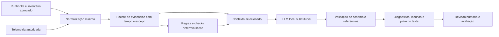

# Revisão crítica e recomendações pesquisadas

18/09/2026 • Escopo: produto, arquitetura e viabilidade do planejamento.

## 1. Parecer

**O projeto faz sentido como ferramenta local de investigação com conhecimento da empresa. Ainda não há evidência suficiente para justificar a plataforma completa ou agentes próprios para todas as plataformas.**

O diretório contém documentos de planejamento; não há aplicação implementada para revisar, medir ou testar. Esta revisão examina o [PRD](02-prd.md) e o [plano](03-plano-de-execucao.md), incluindo limitações do planejamento que eu próprio produzi anteriormente.

A principal correção de direção é validar o benefício incremental do diagnóstico antes de investir em toda a infraestrutura. O plano anterior melhorou a especificação de segurança, mas ainda antecipa esforço de plataforma, identidade, agentes e curadoria que pode se mostrar desnecessário.

Os documentos anteriores permanecem como versão 1.0. Este parecer propõe mudanças, sem apresentar escolhas novas como decisões já aprovadas ou resultados testados.

## 2. O que vale preservar

- Separação entre fonte, fato determinístico e hipótese da IA.
- Identidade distinta para produto, versão, instância e ambiente.
- Inferência substituível, fora do processo central.
- SQLite e relações explícitas antes de banco de grafo dedicado.
- Autorização fora do modelo, coleta limitada e nenhuma ferramenta de shell livre.
- Diagnóstico inconclusivo como resultado válido.
- Avaliação por incidentes e feedback humano estruturado.

O uso de conhecimento sobre a arquitetura junto a observações é coerente com a investigação de incidentes. A metodologia do Google SRE trabalha com hipóteses e evidências que as confirmam ou refutam, advertindo contra correlações espúrias. Isso sustenta o processo do projeto, mas não prova que a LLM melhora sua execução. [Google SRE: Effective Troubleshooting](https://sre.google/sre-book/effective-troubleshooting/).

## 3. Ajustes prioritários encontrados no PRD

P1 significa corrigir antes de usar o planejamento como compromisso de implementação. P2 significa detalhar durante a descoberta.

| Prioridade | Achado e referência | Consequência | Recomendação |
|---|---|---|---|
| P1 | Falta baseline sem IA, [métricas](02-prd.md) | Uma automação de runbook pode resolver os mesmos casos com menos custo | Comparar humano, regras determinísticas, LLM com contexto simples e KIR + LLM |
| P1 | Fila admite cinco pendências, um slot e espera máxima de 120 s, [RNF-03](02-prd.md) | A configuração não oferece atendimento dentro do prazo em rajadas; muitos pedidos podem apenas expirar | Admission control por trabalho estimado; explicitar rejeição versus atendimento garantido |
| P1 | Evidências por 7 dias versus incidentes por 180, [RNF-05](02-prd.md) | Revisões tardias, replay e métricas de proveniência podem perder suporte | Reter um pacote mínimo sanitizado de evidências junto ao incidente, quando permitido |
| P1 | Snapshot fixado e escopo podem mudar durante execução, [snapshot](02-prd.md) | Revogação pode ocorrer após montar contexto; resposta ainda pode expor dados | Revalidar ACL antes de inferência, tool, resposta e export; revogação prevalece sobre snapshot |
| P1 | Cinco tools observam SO, DNS/TCP e logs, [catálogo](02-prd.md) | Processo ativo e TCP aberto não demonstram saúde da aplicação | Restringir promessa a falhas observáveis ou incluir probe HTTP/TLS de endpoint cadastrado |
| P1 | Replay não define corte temporal rigoroso, [avaliação](02-prd.md) | Postmortem ou incidente resolvido pode revelar a resposta à recuperação | Excluir resolução futura e documentos posteriores ao instante simulado |
| P2 | TTL de 15–30 s versus investigação de até 120 s, [tempo](02-prd.md) | Recoletas podem consumir o orçamento sem melhorar a conclusão | Usar snapshot temporal para diagnóstico; atualizar apenas hipóteses que exijam estado corrente |
| P2 | Proveniência medida como cobertura, [sucesso](02-prd.md) | Uma citação válida pode não sustentar a afirmação | Medir também suporte semântico, contradições omitidas e correção da atribuição |
| P2 | Memória e estado desejado sem vínculo claro com release implantada | Lockfile/Git correto pode corresponder à versão errada do serviço | Guardar release/commit/digest observado e expor vínculo desconhecido |
| P2 | “Executa uma vez” na jornada v2, [J4](02-prd.md) | Falha entre efeito externo e journal impede garantia genérica de exactly-once | Prometer deduplicação e reconciliação; idempotência por ação e estado UNKNOWN |
| P2 | Reserva de capacidade e estimativa de esforço não têm unidade operacional completamente definida | Revisão/testes podem ser contados no esforço e novamente como perda de capacidade | Definir esforço completo por pacote; reservar percentual apenas para indisponibilidade não incluída |

### Exemplo concreto da fila

Se um incidente ocupa o único slot por 120 s e cinco pedidos entram juntos, seus inícios podem ocorrer aproximadamente em 120, 240, 360, 480 e 600 s, se todos consumirem esse tempo. O PRD permite expirar os pedidos, portanto não há impossibilidade de implementação; há uma promessa de atendimento mal definida.

Uma solução inicial é recusar admissão quando a previsão de espera ultrapassar o limite, mostrar a espera estimada e manter a capacidade de abrir os fatos coletados sem esperar pela LLM. A previsão deve considerar o escalonador real: slot por turno, coleta concorrente e retomada de incidentes.

### Retenção e autorização precisam prevalecer sobre reprodutibilidade

Para um incidente aceito, guardar IDs de fontes, trechos sanitizados necessários, tempos de coleta, versões, pacote de contexto e resultado. O diagnóstico histórico deve dizer “observado em T”, sem exigir que toda a evidência ainda seja fresca no presente.

Se um dado precisar ser excluído, remover também cópias derivadas do pacote e registrar a indisponibilidade. Uma exceção de proveniência por exclusão autorizada é preferível a reter indevidamente o conteúdo. Toda abertura futura do incidente exige permissão atual, não somente a permissão de quem o criou.

### A observabilidade precisa limitar a promessa

Para o piloto, escolher causas que as fontes realmente permitem distinguir. “Serviço parado” pode ser um sintoma, não a causa raiz. “Disco cheio” não explica sozinho qual processo gerou o crescimento.

Sugestão de saída: causa sustentada quando houver evidência suficiente; caso contrário, melhor hipótese e próximo teste que separa alternativas. Probe HTTP/TLS deve usar endpoint de saúde conhecido, sem efeitos de negócio, destino autorizado, resposta limitada e política contra redirects arbitrários. Não liberar chamadas GET genéricas assumindo que são inofensivas.

## 4. Pesquisa: o que reaproveitar e o que comparar

### HolmesGPT: benchmark funcional mais próximo

HolmesGPT já reúne investigação e integrações com observabilidade, bancos e outras fontes. É um comparativo mais próximo do produto pretendido do que apenas frameworks de memória. As integrações prontas não significam que ele cubra o ambiente Linux/Proxmox pretendido sem adaptação. [Toolsets oficiais](https://holmesgpt.dev/latest/data-sources/builtin-toolsets/).

A integração documentada com Ollama é experimental e alerta para inconsistências de tool calling. Portanto, sua existência não comprova que um modelo local pequeno atenderá o caso; também não justifica descartá-lo sem teste. [HolmesGPT com Ollama](https://holmesgpt.dev/latest/ai-providers/ollama/).

**Sugestão:** mover uma POC curta de HolmesGPT para descoberta, com dados sanitizados e tools restritas. Comparar com o protótipo próprio em qualidade, esforço de integração, funcionamento offline e evidências. Desabilitar ferramentas amplas; não presumir que todas as integrações respeitem a política do projeto.

Se HolmesGPT resolver o problema a custo menor, aproveitar a integração ou construir somente a camada de conhecimento e contexto diferenciada. Se não resolver, registrar precisamente a lacuna: hardware, segurança, conhecimento, UX ou conectores.

### OpenTelemetry: candidato para coleta, não para decisão

O Collector Contrib possui coleta de métricas de host e componentes para logs. O suporte varia por coletor e sistema operacional; não é uma garantia uniforme para todas as plataformas. [Host Metrics Receiver](https://github.com/open-telemetry/opentelemetry-collector-contrib/blob/main/receiver/hostmetricsreceiver/README.md), [File Log Receiver](https://github.com/open-telemetry/opentelemetry-collector-contrib/blob/main/receiver/filelogreceiver/README.md).

Os componentes de filtragem/redaction também têm níveis de estabilidade distintos; a documentação consultada classifica redaction de logs como alpha. Não assumir proteção universal de segredos só por instalar um processor. [Processadores do Collector](https://opentelemetry.io/docs/collector/components/processor/).

**Sugestão:** primeiro inventariar a coleta que já existe na empresa. Usar seus dados por interfaces restritas; avaliar OTel apenas onde preencher uma lacuna. Se for necessário agente próprio, mantê-lo pequeno para coleta sob demanda e política local. O Collector não substitui autorização de tools nem executor de ações. Medir o consumo total, inclusive o coletor reaproveitado.

### SQLite: preservar, com contrato operacional

WAL permite concorrência entre leitores e escritor, mas há apenas um escritor por vez. Leitura longa pode atrasar checkpoint, e o mecanismo depende de acesso local compatível. [Documentação SQLite WAL](https://www.sqlite.org/wal.html).

**Sugestão:** transações curtas, caminho local, controle do crescimento do WAL e coleta de métricas de contenção. Fixar uma geração lógica de conhecimento não exige manter transação aberta durante toda a inferência. Materializar IDs/evidências e fechar a leitura. Usar backup consistente do banco, não copiar apenas o arquivo principal enquanto há atividade.

Não migraria para Postgres ou Neo4j agora. Também não usaria SQLite como repositório ilimitado de telemetria bruta: guardar referências, agregados e evidências relevantes.

### Ansible Runner: opção para a etapa futura de execução

Ansible Runner oferece integração programática com execução Ansible e acompanhamento de eventos/resultados. Isso permite avaliar reaproveitamento se a empresa já operar playbooks. Não resolve por si só autorização, idempotência ou recuperação de cada ação. [Documentação do Runner](https://docs.ansible.com/projects/runner/en/latest/).

**Sugestão:** na v2, comparar executor mínimo próprio com playbooks fixados e auditados. O modelo não deve gerar playbooks livres para executar. A escolha depende de infraestrutura existente; adicionar esse ecossistema só para um restart pode aumentar o trabalho.

## 5. Arquitetura que eu testaria primeiro

O protótipo pode começar com pacotes sanitizados importados, sem conectividade a produção. A coleta online entra depois, preservando controles proporcionais ao novo acesso.

**KIR mínima:** Service, Host, Deployment, Dependency, Source, Observation e Incident, com IDs estáveis, escopo e timestamps. Relações explícitas e proveniência permanecem; mecanismos genéricos de resolução semântica, ontologia extensível e inferência temporal ficam fora do protótipo.

**Execução do diagnóstico:** coleta determinística inicial, uma síntese da LLM e, se necessário, uma rodada adicional de leitura aprovada pela política. Comparar isso com o loop de até cinco turnos antes de assumir que maior autonomia melhora o resultado.

**Sem modelo disponível:** permitir consultar inventário, regras, evidências e runbook. O valor operacional não deve desaparecer quando a inferência está lenta ou indisponível.

**Rust:** continua uma boa opção para componentes próprios se a equipe já dominar a linguagem. Sua obrigatoriedade não demonstra retorno no protótipo. Evitar reescrever conectores e avaliadores existentes apenas para uniformizar linguagem; também evitar adicionar múltiplas linguagens sem necessidade concreta.

## 6. Como provar que a ideia vale o investimento

### Experimento comparativo

Usar os mesmos incidentes, evidências disponíveis até o instante simulado e critérios de correção:

| Variante | O que testa |
|---|---|
| A — operador com runbook e ferramentas atuais | Baseline de tempo e esforço humano |
| B — coleta e regras determinísticas | Quanto do ganho vem de automação convencional |
| C — modelo local com retrieval textual simples | Quanto a LLM agrega sem KIR elaborada |
| D — mesmo modelo com relações e contexto compilado | Ganho incremental da tese central |
| E — HolmesGPT configurado para escopo equivalente | Custo/benefício de reaproveitar produto existente |

Variantes C/D devem usar o mesmo modelo e orçamento para isolar o efeito do contexto. E pode não permitir equivalência perfeita: registrar diferenças, não atribuir vantagem ao framework quando vier do modelo ou de evidências adicionais.

20–30 casos distintos servem para triagem exploratória; pelo menos 20 novos/reservados ajudam na decisão seguinte. Agrupar variações do mesmo incidente no mesmo conjunto. Não permitir que um postmortem ou a solução de incidente semelhante duplicado apareça na entrada de teste.

Medir: tempo até próxima ação útil, acerto entre casos respondidos, taxa de resposta versus abstenção, suporte real das citações, ferramentas desnecessárias, consumo, custo de curadoria e esforço de integração. Mostrar contagens e incerteza; uma diferença de 2 pontos percentuais não pode ser resolvida em um teste de apenas 20 incidentes, no qual um caso vale 5 pontos.

Com operadores, alternar a ordem dos métodos ou usar cenários equivalentes para reduzir aprendizado do gabarito. Casos óbvios de “disco cheio” não devem dominar a amostra e mascarar falhas nos incidentes que justificam o produto.

### Critérios de decisão propostos

- Continuar o produto se houver ganho operacional observável sobre A/B, sem violação de escopo e com custo de manutenção aceitável.
- Se C e D forem equivalentes, manter retrieval simples e adiar KIR avançada; a normalização mínima continua útil.
- Se B resolver quase tudo, entregar um assistente determinístico de runbooks e restringir IA a explicar evidências.
- Se E satisfizer os requisitos a menor esforço, integrar/reaproveitar antes de construir um equivalente.
- Se inferência local não alcançar qualidade/latência, rever modelo, hardware, UX ou escopo; não presumir que fine-tuning é a resposta.

Estas são regras propostas para o experimento, não resultados da pesquisa documental.

## 7. Plano recomendado de validação em quatro semanas

Este é um experimento anterior ao piloto endurecido, não uma nova promessa de concluir em quatro semanas o MVP de 10–15 semanas. Depende de dados disponíveis e aproximadamente duas pessoas com experiência, mais apoio do operador.

| Semana | Trabalho | Evidência de saída |
|---|---|---|
| 1 | Escolher serviço real, causas observáveis, inventariar fontes, rotular casos e medir baseline humano | Corpus temporalmente consistente e problema quantificado |
| 2 | Montar pacote sanitizado, checks determinísticos e inferência local sobre entradas fixas | Comparação B/C e limites de hardware |
| 3 | Adicionar relações mínimas e comparar com HolmesGPT restrito | Diferença C/D/E e esforço de integração |
| 4 | Teste reservado, avaliação com operador e custo de sustentação | Decisão documentada de continuar, reduzir ou reaproveitar |

Esforço indicativo: 6–8 pessoa-semanas para o experimento, sem produção nem agentes multiplataforma. Não somar mecanicamente essa faixa ao plano anterior: ela substitui/reorganiza parte da descoberta e antecipa trabalho de avaliação. Ao final, reestimar somente o que ainda precisa ser construído.

## 8. Sustentação e viabilidade de produto

O projeto tem três frentes distintas: base de conhecimento, diagnóstico e execução. Cada uma deve justificar seu custo. Diagnóstico já pode gerar valor sem automação de mudanças; Windows/Proxmox não devem ser pré-condições universais para testar uma ação Linux se o caso de negócio da ação surgir antes.

Como ferramenta interna, medir frequência de incidentes, minutos economizados, tempo de cadastro, horas de curadoria por semana e custo de operar a plataforma. Um sistema que economiza duas horas e exige dez horas semanais de manutenção falhou nesse contexto, mesmo que diagnostique bem.

Como produto comercial, a hipótese ainda está menos desenvolvida: faltam comprador, segmento, ambiente prioritário, implantação, suporte e diferenciação validada. Uma hipótese a testar seria infraestrutura on-premises de pequenas equipes com documentação dispersa; ela não é demanda comprovada.

O diferencial defensável a investigar é conhecimento confiável da organização com diagnóstico auditável e custo operacional controlado. “Usar Rust”, “ter grafo” e “rodar modelo local” são escolhas/características, não evidência de que alguém adotará o produto.

## 9. Mudanças sugeridas para a próxima versão dos documentos

1. Inserir fase explícita de validação A/B/C/D/E antes do compromisso com a plataforma.
2. Reformular sucesso em termos de decisão operacional e ganho sobre automação sem IA.
3. Corrigir fila, retenção, revogação durante execução e corte temporal do replay.
4. Definir causas observáveis e saúde da aplicação; incluir vínculo de deployment se pós-deploy for caso prioritário.
5. Tornar agentes próprios uma decisão por lacuna, após inventário de telemetria existente.
6. Manter KIR mínima, FTS e relações; condicionar complexidade adicional a evidência.
7. Reestimar por dedicação real e gargalos de função, distinguindo esforço completo e contingência.
8. Separar avanço de conhecimento, plataformas e ações, sem uma dependência artificial entre todos os conectores e uma ação limitada.

## 10. Limitações e fontes

Pesquisa realizada em 18/09/2026 com Context7 e documentação oficial. As páginas latest/main podem mudar; versões devem ser fixadas no experimento. Não foram instalados componentes, baixados modelos, executados benchmarks ou acessados servidores.

As afirmações sobre capacidades documentadas têm links junto ao texto. Recomendações de escopo, estimativas e critérios de decisão são análise de engenharia. Não há evidência nesta entrega para afirmar que qualquer framework, modelo ou hardware vencerá o comparativo.
